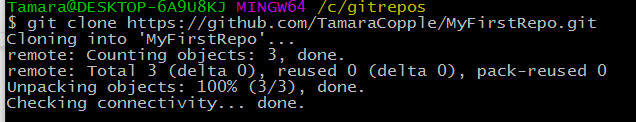

### Part 3: Clone A Repository {#part-3-cloning-your-local-repository}

Your new MyFirstRepo repository exists in the Cloud for now, but that’s not where you will be writing your code. That happens on your own computer. From this point on, your computer is referred to as “local” and your GitHub repository (or repo) is “remote.”

1.  In Google Chrome on the GitHub site, find the green `Clone or download` button. Click on the clipboard icon to the right of the URL to copy it to your system clipboard.

  

2.  In Git Bash or iTerm2, type `cd ..` to move up one directory to your _VersionControl_ directory.

3. Next, type `git clone ` and then paste in the URL of your repo. 

  
  Git Bash users use the `shift` + `ins` keys on your keyboard to paste into Git Bash.  iTerm2 users use `cmd` + `v` keys to paste into iTerm2.
  

  You should see it churn out something that looks like this:

3.  Type `ls -la` to verify that it did indeed copy down the repository. Now you have a remote copy on GitHub, and a local copy that you can modify without affecting the remote until you tell it to.

4.  Type `cd MyFirstRepo` to change directory into your repository. 
  
  The directory is named the same as what you named your repository when you created it so if you named it something else be sure to modify your `cd` command appropriately.
  

5. In Git Bash or iTerm2, type `atom .`  This will open the Atom text editor with the folder where you run that command in context.

  We are going to make a simple change to the _README.md_ file, in order to track the changes in the next section.

6. In Atom, in the left pane where the files are listed, double click on the _README.md_ file.

7. Change something in the file, such as adding a sentence, or a list of the ladies sitting around you tonight. Save the changes.
