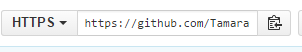

### Part 3: Clone A Repository {#part-3-cloning-your-local-repository}

Your new repository exists in the Cloud for now, but that’s not where you will be writing your code. That happens on your own computer. From this point on, your computer is referred to as “local” and your GitHub repository (or repo) is “remote.”

1.  In Google Chrome on the GitHub site, look for a URL assigned to your new repo. Click on the clipboard icon to the right of the URL. This copies it to your system clipboard.

2.  In **Git Bash** or **iTerm2**, type `git clone ` and then paste in the URL of your repo. You should see it churn out something that looks like this:  

3.  Type `ls -la` to verify that it did indeed copy down the repository. Now you have a copy on GitHub, and a local copy that you can modify without affecting the original.

4.  Change directory into your repository directory. Hint: The directory is named the same as what you named your repository.

5. Next, we are going to make a simple change to the _README.md_ file, so that you can track the changes in the next section.

  In Git Bash or iTerm2, type `atom .`  This will open the Atom text editor with the folder where you run that command in context.

5. Open the **README.md** file and change something in the file, such as adding a sentence, or a list of the ladies sitting around you tonight. Save the changes.
