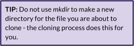
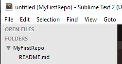

### Part 3: Cloning Your Local Repository {#part-3-cloning-your-local-repository}

Your newborn repository exists in The Cloud for now, but that’s not where you will be writing your code. That happens on your own computer. From this point on, your computer is referred to as “local” and your GitHub repo is “remote.”

1.  Open **Git Bash** or **iTerm2**.
2.  If you are not already there, use command `cd` to change directories to the location where you want your repository to live. 

3.  Back on GitHub, look for a URL assigned to your new repo. Click on the clipboard icon to the right of the URL. This copies it to your system clipboard. HTTPS is the recommended option, and this is fine for what we will do. SSH stands for Secure Shell, but we will not be using it. 

4.  Return to **Git Bash** or **iTerm2**. Type `git clone` and then paste in the URL of your repo. You should see it churn out something that looks like this:  

5.  Just to confirm, you can use your system’s file manager (i.e. Windows Explorer or Mac Finder) to verify that it did indeed copy down the **ReadMe** file. You could also use the ls command to review the contents of the repo from your command line. Now you have a copy on Github, and a local copy that you can modify without affecting the original.
6.  Next, we are going to make a simple change to the readme file, so that you can track the changes in the next section. Open Sublime Text. Select **File--&gt;Open Folder** and drive to the repo you just cloned down to your machine. There should only be one file in it - your ReadMe.md file. 

7.  Open the **README.md** file and in Sublime Text, change something in the file, such as adding a sentence, or a list of the ladies sitting around you tonight. Save the changes.
8.  Back in **Git Bash** or **iTerm2**, use `cd myfirstrepo` to change the directory to the new repo you just cloned.