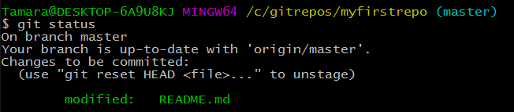
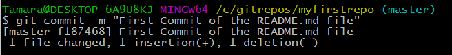

### Part 4: Staging, Committing, and Pushing to GitHub {#part-4-staging-committing-and-pushing-to-github}

There are three vital steps to pushing your changes up to GitHub: **staging**, **committing,** and **pushing.** Let’s try it now.

1.  In Git Bash or iTerm2, type `git status`.  This shows you what changes you have made to your code. You should see that your _README.md_ file has changes: 
    
    
    Notice it tells us these are "Changes not staged for commit:"
    
    If you do not see any changes, double check that you saved your file in Atom.

2. Type `git add README.md`.

3. To verify that your files were added, type `git status` again.

    Notice this time it tells us these are "Changes to be committed:" which means we've staged this file successfully.

4. In Atom, make another change to your _README.md_ file and save the changes.

5. In Git Bash or iTerm2, check your status again by typing `git status`.  This time it knows you already had changes ready to be committed _AND_ you have some more changes that have not yet been staged. 

    

6. This time,  type `git add -A`, to add all files you have modified since the last commit to the staging area.

    
The capitalization of the `A` is important in this step.  A lowercase -a is not a command that Git recognizes by itself.
    

7. Double check yourself that everything is staged by typing `git status`.

7.  Commit your changes with a brief commit message by typing `git commit -m "Updated README.md to practice staging, committing, and pushing."`.

    
The -m flag allows you to provide a description of the changes. This is important information for those who may collaborate on the code later.
    

    Your changes have been committed and are ready to be pushed up to GitHub.
    
    

3.  Type `git push origin master` to initiate the push.

    
“origin” tells Git you are pushing the changes to the original remote location.

“master” indicates which branch within the remote location you'd like to push to.
    

**Voila! You have pushed your first revision to GitHub!**
