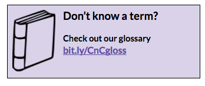
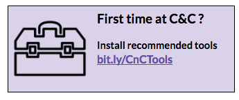

# Coding & Cocktails Session 4:
## Version Control using Git {#version-control-using-git}

****

### Overview

During the session we’ll discuss distributed version control, through a tool called Git. 

### Helpful Keyboard Shortcuts
|Command|Mac Key Combination|Windows Key Combination|
|--|--|--|
|Cut|`cmd` + `x`|`ctrl` + `x`|
|Copy|`cmd` + `c`|`ctrl` + `c`|
|Paste|`cmd` + `v`|`ctrl` + `v`|
|Undo|`cmd` + `z`|`ctrl` + `z`|
|Redo|`cmd` + `y`|`ctrl` + `y`|
|Save|`cmd` + `s`|`ctrl` + `s`|
|Select all|`cmd` + `a`|`ctrl` + `a`|
|Find|`cmd` + `f`|`ctrl` + `f`|
|Switch between open apps/programs |`cmd` + `tab`|`alt` + `tab`|
|Switch between programs on the taskbar| N/A | `windows key` + `tab`|
|Switch between Chrome windows. |`shift` + `cmd` + `~`| N/A |

