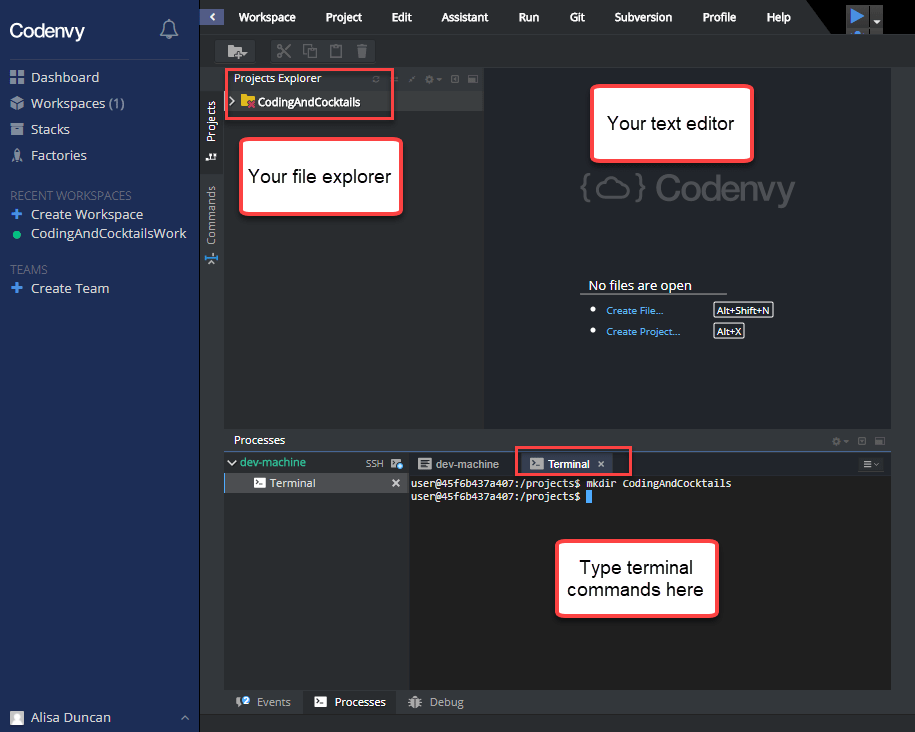

Tonight we'll use [Codenvy](https://codenvy.com/)-- an online development environment. We will be able to follow along with the worksheet except you will not have access to GitKraken or vim. Specific deviations from the instructions for Chromebook users are called out in the worksheet steps.

### Requirements
1. A GitHub account. If you don't have a GitHub account, follow the instructions to [Create a GitHub account](https://codingandcocktailskc.gitbooks.io/coding-cocktails-the-tools/content/tools-git/#create-a-github-account).

### Codenvy instructions
1. [Create a Codenvy account](https://codenvy.io/site/login?redirect_url=https%3A%2F%2Fcodenvy.io%2F) by using your GitHub account. It will ask you for your name, company (put in "None" or anything you like), and role (use Hobbyist).

1. You are navigated to the Dashboard. Click **Create Workspace** button in the **Recent Workspaces** section. 

1. On the New Workspace page, in the **NAME** section name your workspace "CodingAndCocktailsWork".

1. In the **SELECT STACK** section, scroll down and select **Node**. 
   

1. Click the green **CREATE** button at the bottom of the page. It will take a minute or so to create your workspace and start your dev-machine.

1. The "CodingAndCocktailsWork" workspace now opens. Refer to the image below for workspace layout.
   

1. Click in the terminal window to give it focus and type `pwd`. This is your home directory. Any time you see instructions to navigate to home directory, use `/projects`.

1. Set your user name by running the command `git config --global user.name "Your Name"` replacing the text `Your Name` with your own full name, keeping the quotation marks.

1. Set your user email address by running the command `git config --global user.email youremail@example.com` replacing `youremail@example.com` with your own email address.

1. In the terminal type `mkdir CodingAndCocktails` and press `Enter` to create the "CodingAndCocktails" folder. You are now ready to follow tonight's session work.


You may have to enter your GitHub username and GitHub password every time you push to GitHub. Follow the terminal instructions if prompted to do so.



Codenvy will stop your workspace if you are idle for too long and displays a message that says "Workspace is not running". Press **Start** to start your workspace back up. You may have to navigate back to the directory you were working in.


