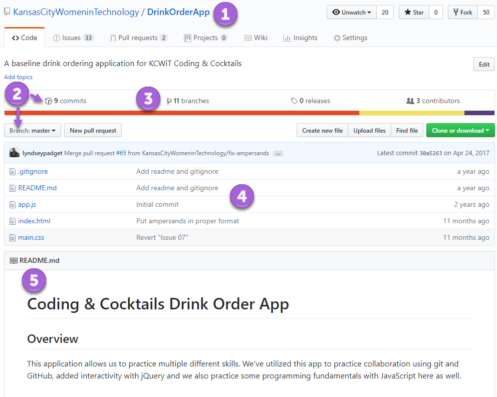
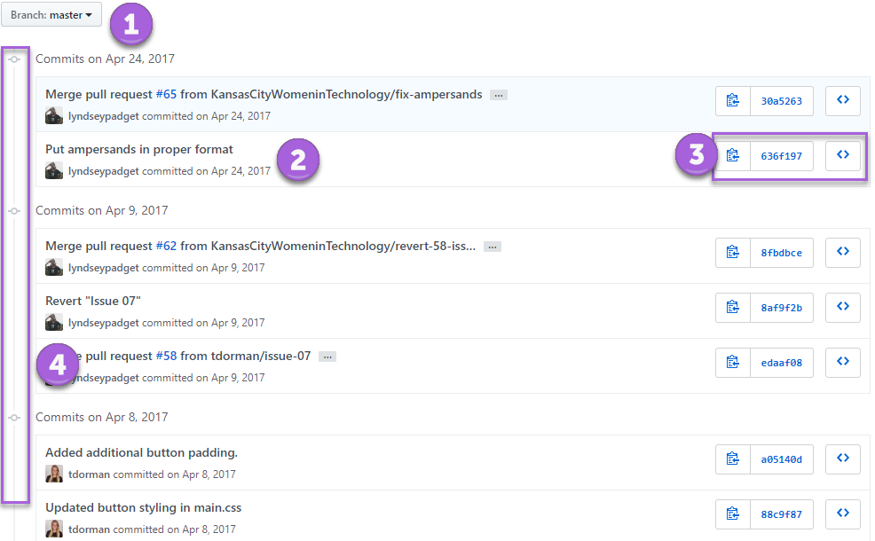
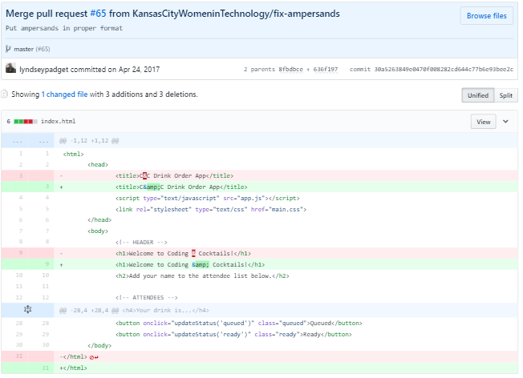

1. Open Chrome and navigate to [https://github.com](https://github.com). Sign in if you aren't already signed in to GitHub.

1. Let's find a repository. Search for "KansasCityWomeninTechnology/DrinkOrderApp" using **Search GitHub** in the toolbar at the top of the page. Click on the repository result.
   
GitHub is a big place! Sometimes there are many repositories with the same name. In this search we are searching repositories named "DrinkOrderApp" by the user "KansasCityWomeninTechnology". 
    

1. We see an overview for a repository. Let's inspect a little closer. GitHub displays information about the repository such as 

   
     <i class="fa fa-circle fa-stack-2x help-annotations"></i>
     <strong class="fa-stack-1x help-annotations-text">1</strong>
   
   Owner and repository name

   
     <i class="fa fa-circle fa-stack-2x help-annotations"></i>
     <strong class="fa-stack-1x help-annotations-text">2</strong>
   
   The selected branch and the number of changes (aka commits) made in that branch

   
     <i class="fa fa-circle fa-stack-2x help-annotations"></i>
     <strong class="fa-stack-1x help-annotations-text">3</strong>
   
   The number of branches in the repository

   
     <i class="fa fa-circle fa-stack-2x help-annotations"></i>
     <strong class="fa-stack-1x help-annotations-text">4</strong>
   
   List of files for the selected branch and when the files were last modified

   
     <i class="fa fa-circle fa-stack-2x help-annotations"></i>
     <strong class="fa-stack-1x help-annotations-text">5</strong>
   
   Read me text that the author creates to provide information about the source code

   

1. Click on ** commits** (circle #2) to see the list of commits for the branch. Now we see more details about each commit such as 

   
     <i class="fa fa-circle fa-stack-2x help-annotations"></i>
     <strong class="fa-stack-1x help-annotations-text">1</strong>
   
   The selected branch

   
     <i class="fa fa-circle fa-stack-2x help-annotations"></i>
     <strong class="fa-stack-1x help-annotations-text">2</strong>
   
   The author, date, and author's message about the changes

   
     <i class="fa fa-circle fa-stack-2x help-annotations"></i>
     <strong class="fa-stack-1x help-annotations-text">3</strong>
   
   Further actions you can take on a commit

     

1. Let's dive a little deeper and focus on circle #3. There's 3 actions you can take. Click on the middle button (the one with letters and numbers) on the first commit.
    
It might look like random letters and numbers, but it's not! This is the unique identifier to the commit.
    

1. You now see the differences between the previous version and this commit. 

   

   The pink highlights show the previous version and the light green highlights are the new version. The darker red highlights shows the deleted characters and the dark green highlights show the added characters.
   
This is more commonly known by its abbreviated name, "diff view".
   

1. Click the <i class="fa fa-arrow-left" aria-hidden="true"></i> button in Chrome to navigate back to the list of commits.

1. In the further actions you can take on a commit (circle #3), click on the button to the right (the one that looks like ). Now you are browsing the repository files as they were in this commit. You have a snapshot of the entire repository on every commit!

1. Click the name of the repository "DrinkOrderApp" at the top of the page to navigate back to the main repository page.

