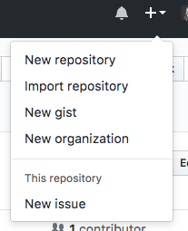
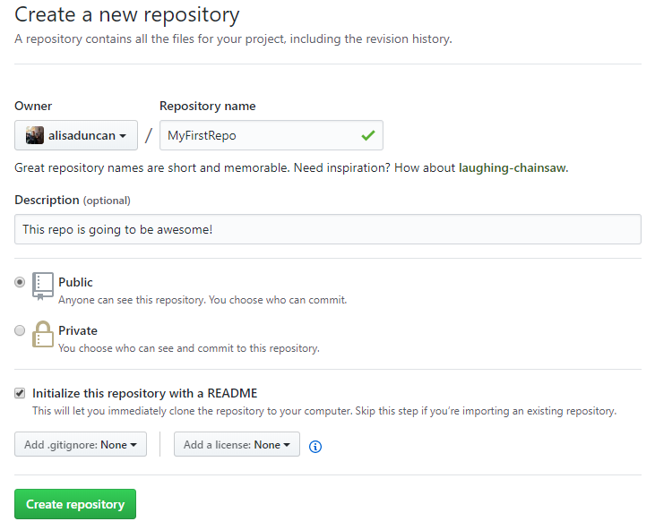

1. In GitHub, create a new repository by clicking the <span class="octicon octicon-plus"></span> button in the upper right corner. Select **New repository**.
   
   

1. Name your repository "MyFirstRepo". Add a short description and check the **Initialize this repository with a README** checkbox. Click **Create repository**.

   

    
You can ignore the **Add .gitignore** and **Add a license** dropdowns for the time being.  You won't need them for what we are doing this evening.
    

1. You now have a repo! Notice you're automatically on 'master' branch. Click the green **Clone or download** button and copy the link by clicking on the <span class="octicon octicon-clippy"></span> button.

1. Open your terminal and navigate to "CodingAndCocktails/Session4" folder in your home directory. If you are already in "DrinkOrderApp", you can type `cd ..` <i class="fa fa-share fa-rotate-180"></i>.

1. Type `git clone` and paste the link to your repository that you copied in the previous step. Press `Enter`.

1. Type `ls` <i class="fa fa-share fa-rotate-180"></i>. You should see a new folder named "MyFirstRepo". 

1. Navigate into the directory by typing `cd MyFirstRepo` <i class="fa fa-share fa-rotate-180"></i>. Notice your terminal now contains the name of the branch 'master'.

   
Don't forget to use Tab completion to make typing in the terminal easier!
   

1. Type `ls -al` <i class="fa fa-share fa-rotate-180"></i>. You should see the following files
   ```
   ./
   ../
   .git/
   README.md
   ```

1. Type `cat README.md` <i class="fa fa-share fa-rotate-180"></i>. You should see the contents of the read me text, which is the same text displayed in GitHub repo page.

1. Git has special files. One of them is the ".git" folder. It contains all the information on reconstructing the version history for your repo.  

