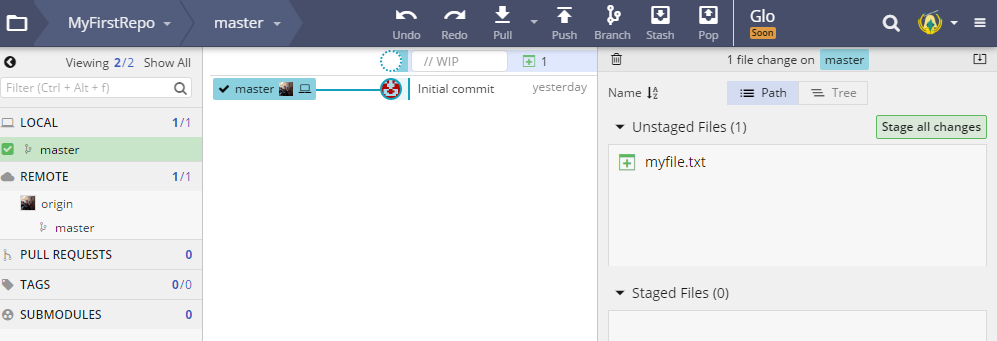

1. Let's create a new file by using the command line. Type `echo Hello world! > myfile.txt` <i class="fa fa-share fa-rotate-180"></i>. 
   ```
**[terminal]
**[prompt LadyDev@Coding&Cocktails]**[path  ~/CodingAndCocktails/Session4/MyFirstRepo (master)]
**[delimiter λ ]**[command echo Hello world! > myfile.txt]
   ```
   
Your terminal may have changed when you created a new file. Mac users may see a yellow x appear and Cmder users may see the color of '(master)' branch name change. This is a way your terminal helps you keep track of changes in your git repository.
   

1. Let's check out the status again. This time the terminal lists _myfile.txt_ as an untracked file.
   ```
**[terminal]
**[prompt LadyDev@Coding&Cocktails]**[path  ~/CodingAndCocktails/Session4/MyFirstRepo (master)]
**[delimiter λ ]**[command git status]
On branch master
Your branch is up to date with 'origin/master'.
Untracked files:
  (use "git add <file>..." to include in what will be committed)
           myfile.txt 
nothing added to commit but untracked files present (use "git add" to track)
   ```

1. Take a look at GitKraken. You'll see a dotted circle above your commit. If you click on it, it lists _myfile.txt_ in **Unstaged Files**.
   
   

      
Something here about what an untracked file is
   


