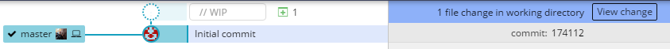

1. Let's create a new file by using the command line. Type `touch cocktails.txt` <i class="fa fa-share fa-rotate-180"></i>. 
   ```
**[terminal]
**[prompt LadyDev@Coding&Cocktails]**[path  ~/CodingAndCocktails/VersionControl/MyFirstRepo (master)]
**[delimiter λ ]**[command touch cocktails.txt]
   ```
   
Your terminal may have changed when you created a new file. Mac users may see a yellow X appear and Cmder users may see the color of '(master)' branch name change. This is a way your terminal helps you keep track of changes in your git repository.
   

1. Let's check out the git status again. This time the terminal lists _cocktails.txt_ as an untracked file.
   ```
**[terminal]
**[prompt LadyDev@Coding&Cocktails]**[path  ~/CodingAndCocktails/VersionControl/MyFirstRepo (master)]
**[delimiter λ ]**[command git status]
On branch master
Your branch is up to date with 'origin/master'.
Untracked files:
(use "git add <file>..." to include in what will be committed)
**[error    cocktails.txt]
nothing added to commit but untracked files present (use "git add" to track)
   ```
   
An untracked file is a file that Git doesn't know about. You have to explicitly ask Git to track a file. Git doesn't do this automatically in case you accidentally include files that shouldn't be in source control (such as large files or application files).
   

1. We can add the file to Git and stage the file at the same time by typing `git add cocktails.txt` <i class="fa fa-share fa-rotate-180"></i>.

1. Let's check out the status again. This time the terminal lists _cocktails.txt_ as a change to be committed. 
   ```
**[terminal]
**[prompt LadyDev@Coding&Cocktails]**[path  ~/CodingAndCocktails/VersionControl/MyFirstRepo (master)]
**[delimiter λ ]**[command git status]
On branch master
Your branch is up to date with 'origin/master'.
Changes to be committed:
(use "git reset HEAD <file>..." to unstage)
**[warning    new file:   cocktails.txt]
   ```

1. In GitKraken, click on the **View change** button or click ont "//WIP" in the git tree view to see the staged files.

   

1. Oops! We meant to add some text to the file. It should say "My favorite cocktail is" in _cocktails.txt_. We need to fix that. You can use any editor you want to add the text. Make the change and save the file.
   
This is a good opportunity to practice your vim skills. In the terminal, type `vim cocktails.txt` <i class="fa fa-share fa-rotate-180"></i> to launch vim. Type `i` for insert and add the text. When complete, type `Esc` and then type `:wq`. Press `Enter` to save your file. Refer to [Command Line Basics](https://codingandcocktailskc.gitbooks.io/session-2-command-line-basics/content/ws2-redirect-pipes/#edit) for more details on 'vim'.

Chromebook users - use the built in text editor to make your changes.
   

1. Check the git status in the terminal and take a look at GitKraken. Your terminal shows _cocktails.txt_ as unstaged and ready to be committed. What?! 😕 
   ```
**[terminal]
**[prompt LadyDev@Coding&Cocktails]**[path  ~/CodingAndCocktails/VersionControl/MyFirstRepo (master)]
**[delimiter λ ]**[command git status]
On branch master
Your branch is up to date with 'origin/master'.
Changes to be committed:
  (use "git reset HEAD <file>..." to unstage)  
**[warning    new file:   cocktails.txt]
Changes not staged for commit:
  (use "git add <file>..." to update what will be committed)
  (use "git checkout -- <file>..." to discard changes in working directory)
**[error     modified:   cocktails.txt]
   ```
   
This is because when you ran `git add`, Git staged the file in the state at that time. With a new change, we have to stage the file again.  
   

1. Stage _cocktails.txt_.
   
<details>
<summary>
Need a little help? Expand this section for guidance. 
</summary>
Type <code>git add cocktails.txt</code> <i class="fa fa-share fa-rotate-180"></i>.
</details>
   

