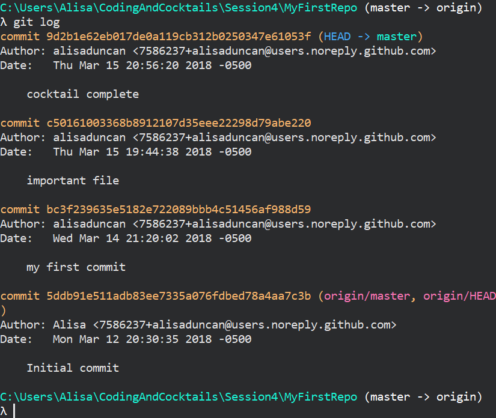
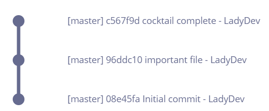

1. We've made quite a few changes. We can see the history in the command line. Type `git log` <i class="fa fa-share fa-rotate-180"></i> to see all the changes you made tonight. It should looks similar to this

   

   If we mapped out your commits, your git graph currently looks like this
   
   

   
It shows each commit (with the unique identifier) and the commit message along with the author and date. Notice the top commit also has `(HEAD -> master)`. This says your own copy of the "master" branch is at the top commit. Notice the bottom commit has `(origin/master, origin/HEAD)`. This is the last change that your remote, GitHub, is aware of. Your terminal may not show where HEAD is.
   
      
Your terminal automatically shows the output using 'less'. To exit out of 'less' type `q`. Refer to [Command Line Basics](https://www.gitbook.com/book/codingandcocktailskc/session-2-command-line-basics/details) for more details on 'less'. 
   

1. We have 3 commits for our work so far, but we don't need to keep both commits for _cocktails.txt_. We can squash our changes. Let's squash the last 2 changes, both of which were to _cocktails.txt_. Type `git reset --soft HEAD~2` <i class="fa fa-share fa-rotate-180"></i>.
   
We told git to reset the last two commits you made. This command also removes the commit message but stages your file.
   

1. Think of a good commit message for your cocktails change and commit your file with your message.
   

Need a little help? Expand this section for guidance. 

Type <code>git commit -am "helpful commit message here"</code> <i class="fa fa-share fa-rotate-180"></i>.

   

1. Let's check `git log` again. Now we see 2 commits instead of 3. Your git graph now looks like this

   

      
Use `q` to exit `less`.
   

1. We can also see the git graph in the terminal. Type `git log --graph` <i class="fa fa-share fa-rotate-180"></i> to see the commits for this branch with the lines to show the path. This matches up with the git graph image.

1. Type `git push` <i class="fa fa-share fa-rotate-180"></i>. Take a look at git status (states up to date with 'origin/master'). 

1. In Chrome, navigate to your "MyFirstRepo" page and reload the page. You should see your new file _cocktails.txt_. You can click on the file to see the contents.

1. You will also see ** 2 commits** above the dropdown for 'master' branch. Click on it to navigate to your commit history. The commit history and path should match what you saw in the terminal.
