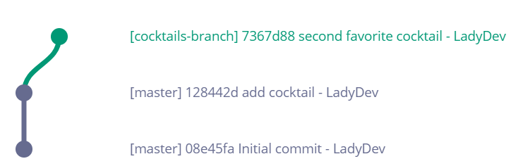

1. We've been making all our changes to 'master' branch. Let's create a branch for our next set of work. In the terminal, type `git checkout -b cocktails-branch` <i class="fa fa-share fa-rotate-180"></i>. It should look like this
   ```
**[terminal]
**[prompt LadyDev@Coding&Cocktails]**[path  ~/CodingAndCocktails/VersionControl/MyFirstRepo (master)]
**[delimiter λ ]**[command git checkout -b cocktails-branch]
Switched to a new branch 'cocktails-branch'
   ```
   
We passed in the '-b' flag into `git checkout` command. This means we'll create and checkout a branch at the same time.
   
   
Your terminal might look a little different after creating a branch. The terminals we have you use include the branch name, so you should see 'cocktails-branch' included in your prompt.
   

1. Type `git status` <i class="fa fa-share fa-rotate-180"></i>. It should look something like this
   ```
**[terminal]
**[prompt LadyDev@Coding&Cocktails]**[path  ~/CodingAndCocktails/VersionControl/MyFirstRepo (cocktails-branch)]
**[delimiter λ ]**[command git status]
On branch cocktails-branch
nothing to commit, working tree clean

   ```

1. In Atom, edit _cocktails.txt_ by adding a new sentence. Perhaps add your second favorite cocktail? Save the file.

1. In the terminal, stage your file and commit your change. 
   
<details>
<summary>
Need a little help? Expand this section for guidance. 
</summary>
Type <code>git commit -am "personalized message here"</code> <i class="fa fa-share fa-rotate-180"></i>.
</details>
   

1. Take a look in your on GitHub in the branches dropdown. We don't see 'cocktails-branch' in there yet. We've created a branch but the remote doesn't know about it. We need to push our new branch info.

1. In the terminal type `git push` <i class="fa fa-share fa-rotate-180"></i> like we did before to push our changes. Oh oh! We got an error
   ```
**[terminal]
**[prompt LadyDev@Coding&Cocktails]**[path  ~/CodingAndCocktails/VersionControl/MyFirstRepo (cocktails-branch)]
**[delimiter λ ]**[command git push]
fatal: The current branch cocktails-branch has no upstream branch.
To push the current branch and set the remote as upstream, use
    git push --set-upstream origin cocktails-branch
   ```
   
The remote, GitHub, has no knowledge of 'cocktails-branch'. We need to provide the branch name (cocktails-branch) and where to create the branch (origin). We add the flag '--set-upstream' so that the remote has this branch reference and we don't have to provide the 'cocktails-branch' and 'origin' parameters for subsequent `git push` commands.
   

1. Follow the instructions in the error and type `git push --set-upstream origin cocktails-branch` <i class="fa fa-share fa-rotate-180"></i>.

1. Type `git log --graph` <i class="fa fa-share fa-rotate-180"></i>. You should see your change on 'cocktails-branch' and the second commit from the top is where 'master' is. You diverged from 'master'. Your git graph looks like this

   

1. Switch back to 'master' by typing `git checkout master` <i class="fa fa-share fa-rotate-180"></i>.

1. In Atom, notice your change to _cocktails.txt_ is no longer there. That's because our change exists in the 'cocktails-branch' branch. 

