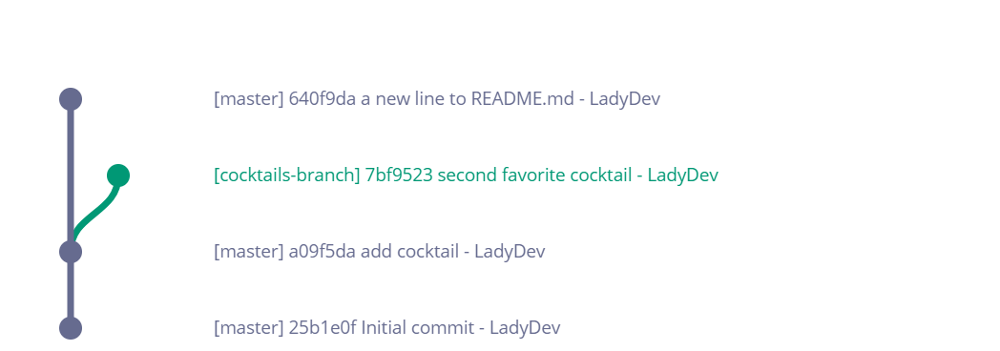
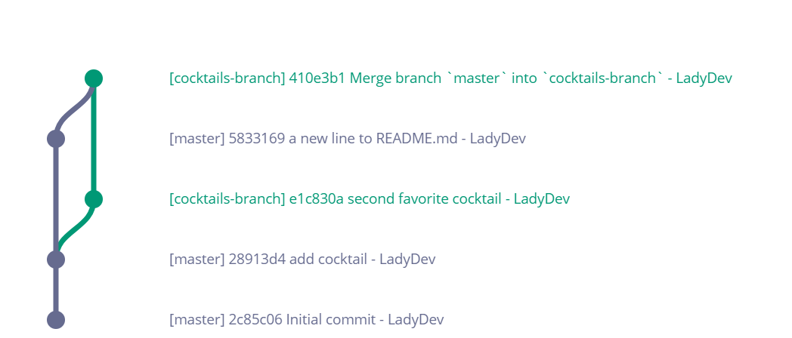

1. In Atom, add a new sentence to _README.md_. Save your file.

1. In the terminal stage, commit, and push your change.
   
<details>
<summary>
Need a little help? Expand this section for guidance. 
</summary>
Type <code>git commit -am "personalized message here"</code> <i class="fa fa-share fa-rotate-180"></i>.
Type <code>git push</code> <i class="fa fa-share fa-rotate-180"></i>.
</details>
   

1. Check the graph by typing `git log --graph` <i class="fa fa-share fa-rotate-180"></i>. It doesn't look right. Your 2 branches diverged. Now there is a change in 'master' that your 'cocktails-branch' doesn't know about. Your changes for both branches now looks like the picture below but the terminal doesn't reflect this.
   
   

1. There's another parameter we can add to the `git log` command to see the graph for all branches. Type `git log --graph --all` <i class="fa fa-share fa-rotate-180"></i>. 
   
JAD TODO Something here? Add `--oneline`??
   

1. We want to bring our changes in the 'cocktails-branch' into 'master' by creating a pull request. Before we do so, we should reconcile the differences in branches. Checkout 'cocktails-branch'.
   
<details>
<summary>
Need a little help? Expand this section for guidance. 
</summary>
Type <code>git checkout cocktails-branch</code> <i class="fa fa-share fa-rotate-180"></i>.
</details>
   

1. Make sure you have the latest changes in 'cocktails-branch' by typing `git pull` <i class="fa fa-share fa-rotate-180"></i>.

1. To sync the changes in 'master' branch into 'cocktails-branch', type `git merge master` <i class="fa fa-share fa-rotate-180"></i>. Your terminal should look like this
   ```
**[terminal]
**[prompt LadyDev@Coding&Cocktails]**[path  ~/CodingAndCocktails/VersionControl/MyFirstRepo (cocktails-branch)]
**[delimiter λ ]**[command git merge master]
Merge made by the 'recursive' strategy.
 README.md | 1 +
 1 file changed, 1 insertion(+)
   ```
   
JAD TODO - Some sort of info about what's going on here? (maybe that this isn't always necessary because GH would just merge it??)
   

1. Open Atom and take a look at _README.md_. It now contains the sentence you added in the beginning of this section.

1. We created a merge commit in 'cocktails-branch' to bring in code from 'master'. In the terminal, take a look at the git graph. We see the path now includes 'master' branch. Your graph now looks like this

   

