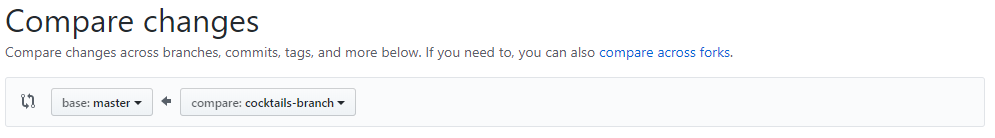
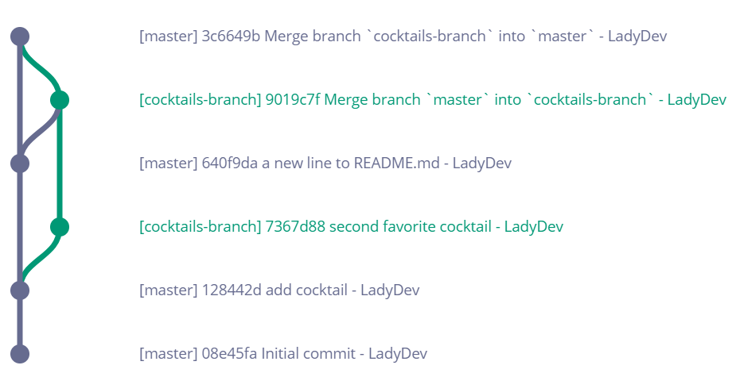

1. In Chrome, navigate to your "MyFirstRepo" page. Click on the button next to your selected branch labeled **New pull request**. 

1. Under **Compare changes**, use the right dropdown menu to select 'cocktails-branch'.
   

1. Your view will switch to **Open a pull request**. Scroll down to the bottom of the page to see a diff of changes. Press the green **Create pull request** button.

1. Click the green **Merge pull request** button and **Confirm merge** button to merge your changes.

1. Click the **<span class="octicon octicon-code"></span> Code** tab at the top of the page to navigate back to your code. Click on _cocktails.txt_ to see your changes from 'cocktails-branch' in 'master'.

1. In the terminal, checkout 'master'. Type `git fetch` <i class="fa fa-share fa-rotate-180"></i> and then check git status. We see that our local copy of 'master' is behind 'origin/master'
   ```
**[terminal]
**[prompt LadyDev@Coding&Cocktails]**[path  ~/CodingAndCocktails/VersionControl/MyFirstRepo (master)]
**[delimiter λ ]**[command git status]
On branch master
Your branch is behind 'origin/master' by 2 commits, and can be fast-forwarded.
  (use "git pull" to update your local branch)
nothing to commit, working tree clean

   ```
   
Fetch updates references in your local repository so that it's aware of what's going on in remote, but it does not pull down any changes. 
   

1. Type `git pull` <i class="fa fa-share fa-rotate-180"></i> to pull changes from the remote to our local copy. Check `git status` again.
   
`git pull` wraps `git fetch` plus `git merge`.
   

1. Open Atom and take a look at _cocktails.txt_. You now have the changes you made in 'cocktails-branch'.

1. Check the git graph for 'master' branch. It now contains the commits you made in 'cocktails-branch. Your git graph now looks like this
   
